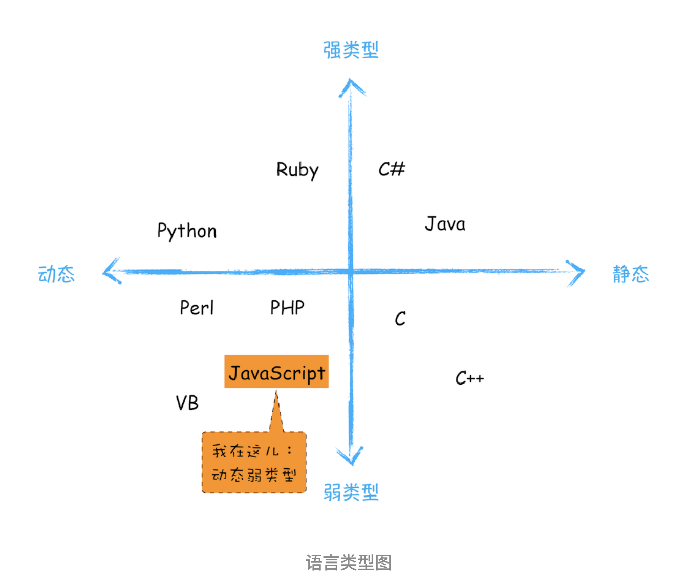
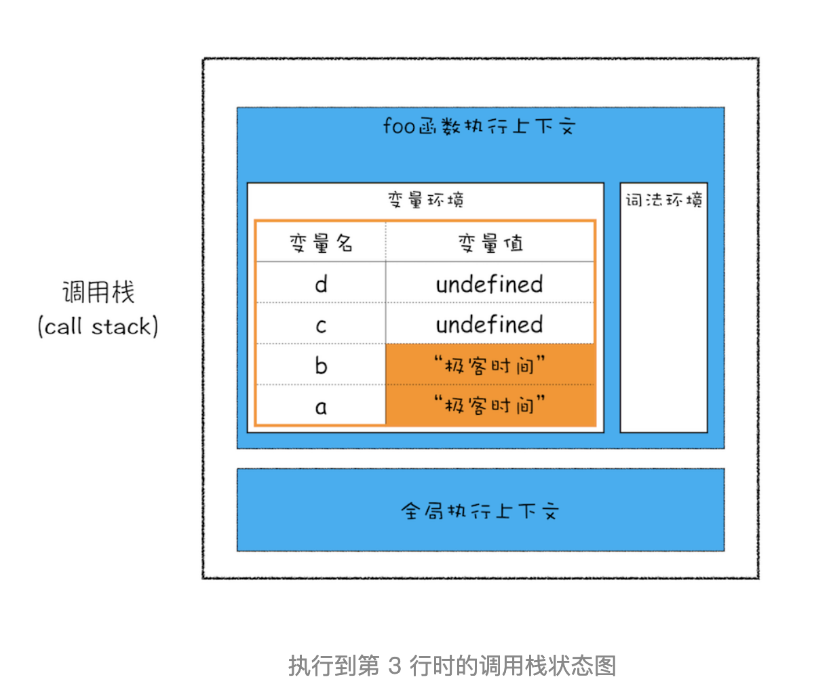
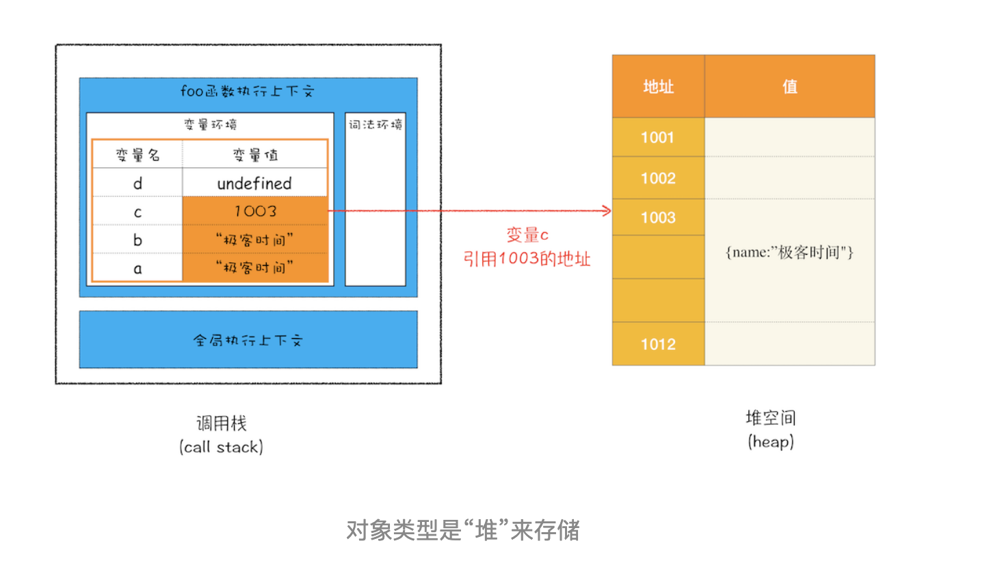
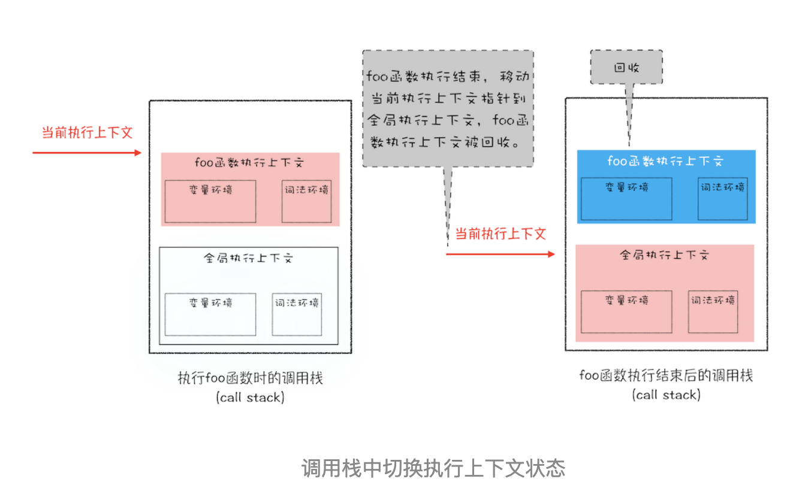
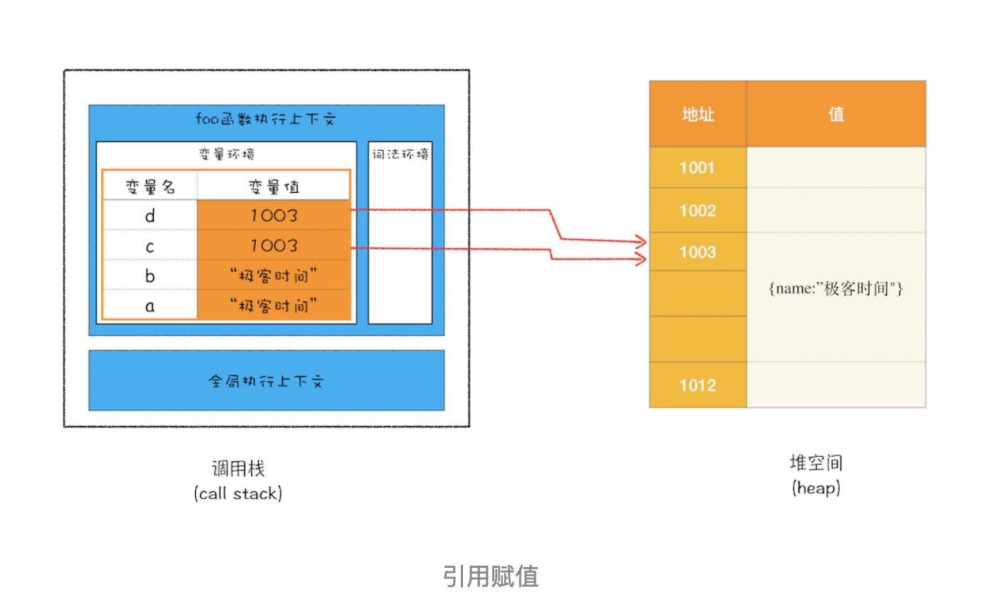
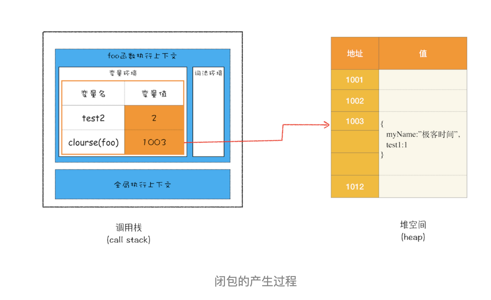

# 栈空间和堆空间：数据是如何存储的

对于前端开发者来说，JavaScript 的内存机制是一个不被经常提及的概念，因此很容易被忽视。特别是一些非计算机专业的同学，对内存机制可能没有非常清晰地认识，甚至有些同学根本就不知道 JavaScript 的内存机制是什么。

但是如果你想成为行业专家，并打造高性能前端应用，那么你就必须要搞清楚 JavaScript 的内存机制了。

其实，要搞清楚 JavaScript 的内存机制并不是一件很困难的事，在接下来的三篇文章（数据在内存中的存放、JavaScript 处理垃圾回收以及 V8 执行代码）中，我们将通过内存机制的介绍，循序渐进带你走进 JavaScript 内存的世界。

今天我们讲述第一部分的内容——JavaScript 中的数据是如何存储在内存中的。虽然 JavaScript 并不需要直接去管理内存，但是在实际项目中为了能避开一些不必要的坑，你还是需要了解数据在内存中的存储方式的。

## 让人疑惑的代码

首先，我们先看下面这两段代码：

```js
function foo() {
  var a = 1
  var b = a
  a = 2
  console.log(a)
  console.log(b)
}
foo()
```

```js
function foo() {
  var a = { name: '极客时间' }
  var b = a
  a.name = '极客邦'
  console.log(a)
  console.log(b)
}
foo()
```

若执行上述这两段代码，你知道它们输出的结果是什么吗？下面我们就来一个一个分析下。

执行第一段代码，打印出来 a 的值是2，b 的值是1，这没什么难以理解的。

接着，再执行第二段代码，你会发现，仅仅改变了 a 中 name 的属性值，但是最终 a 和 b 打印出来的值都是 { name: '极客邦' }。这就和我们预期的不一致了，因为我们想改变的仅仅是 a 的内容，但 b 的内容也同时被改变了。

要彻底弄清楚这个问题，我们就得先从“JavaScript 是什么类型的语言”讲起。

## JavaScript是什么类型的语言

每种编程语言都具有内建的数据类型，但它们的数据类型常有不同之处，使用方式也很不一样，比如 C 语言在定义变量之前，就需要确定变量的类型，你可以看下面这段 C 代码：

```c++
int main()
{
  int a = 1;
  char* b = '极客时间';
  bool c = true;
  return 0;
}
```

上述代码声明变量的特点是：在声明变量之前需要先定义变量类型。我们把这种在使用之前就需要确认其变量数据类型的称为静态语言。

相反地，我们把在运行过程中需要检查数据类型的语言称为动态语言。比如我们所讲的 JavaScript 就是动态语言，因为在声明变量之前并不需要确认其数据类型。

虽然 C 语言是静态，但是在 C 语言中，我们可以把其他类型数据赋予给一个声明好的变量，如：

```js
c = a
```

前面代码中，我们把 int 型的变量 a 赋值给了 bool 型的变量 c，这段代码也是可以编译的，因为在赋值过程中，C 编译器会把 int 型的变量悄悄转换为 bool 型的变量，我们通常把这种偷偷转换的操作称为隐式类型装换。而支持隐式类型转换的语言称为弱类型语言，不支持隐式类型装换的语言称为强类型语言。在这点上，C 和 JavaScript 都是弱类型语言。

对于各种语言的类型，你可以参考下图：



## JavaScript的数据类型

现在我们知道了，JavaScript 是一种弱类型的、动态的语言。那这些特点意味着什么呢？

- **弱类型**，意味着你不需要告诉 JavaScript 引擎这个或那个变量是什么数据类型，JavaScript 引擎在运行代码的时候自己会计算出来。

- **动态**，意味着你可以使用同一个变量保存不同类型的数据。

那么接下来，我们再来看看 JavaScript 的数据类型，你可以看下面这段代码：

```js
var bar
bar = 12 
bar = '极客时间'
bar = true
bar = null
bar = { name: '极客时间' }
```

从上述代码中你可以看出，我们声明了一个 bar 变量，然后可以使用各种类型的数据值赋予给该变量。

在 JavaScript 中，如果你想要查看一个变量到底是什么类型，可以使用 `typeof` 运算符。具体使用方式如下所示：

```js
var bar
console.log(typeof bar) // undefined
bar = 12 
console.log(typeof bar) // number
bar = '极客时间'
console.log(typeof bar) // string
bar = true
console.log(typeof bar) // boolean
bar = null
console.log(typeof bar) // object
bar = { name: '极客时间' }
console.log(typeof bar) // object
```

执行这段代码，你可以看到打印出来了不同的数据类型，有 undefined、number、boolean、object 等。那么接下来我们就来谈谈 JavaScript 到底有多少种数据类型。

其实 JavaScript 中的数据类型一共有 8 种，它们分别是：


了解这些类型之后，还有三点需要你注意一下。

- 第一点，使用 typeof 检测 Null 类型时，返回的是 Object。这是当初 JavaScript 语言的一个 Bug，一直保留至今，之所以一直没修改过来，主要是为了兼容老的代码。

- 第二点，Object 类型比较特殊，它是由上述 7 种类型组成的一个包含了 key-value 对的数据类型。如下所示：

```js
let myObj = {
  name: '极客时间',
  update: function() {....}
}
```

从中你可以看出来，Object 是由 key-value 组成的，其中的 value 可以是任何类型，包括函数，这也就意味着你可以通过 Object 来存储数据，Object 中的函数有称为方法，比如上述代码中的 update 方法。

- 第三点，我们把前面的 7 种数据类型称为原始类型，把最后一个对象类型称为引用类型，之所以把它们区分为两种不同的类型，是因为它们在内存中存放的位置不一样。到底怎么个不一样法呢？接下来，我们就来讲解一下 JavaScript 的原始类型和引用类型到底是怎么储存的。

## 内存空间

要理解 JavaScript 在运行过程中数据是如何存储的，你就得先搞清楚其存储空间的种类。下面是我画的 JavaScript 的内存模型，你可以参考下：


从图中可以看出，在 JavaScript 的执行过程中，主要有三种类型的内存空间，分别是代码空间、栈空间和堆空间。

其中的代码空间主要是存储可执行代码的，这个我们后面再做介绍，今天主要来说说栈空间和堆空间。

## 栈空间和堆空间

这里的栈空间就是我们之前反复提及的调用栈，是用来存储执行上下文的。为了搞清楚栈空间是如何存储数据的，我们还是先看下面这段代码：

```js
function foo() {
  var a = '极客时间'
  var b = a
  var c = { name: '极客时间' }
  var d = c
}
foo()
```

前面文章我们已经讲解过了，当执行一段代码时，需要先编译，并创建执行上下文，然后再按照顺序执行代码。那么下面我们来看看，当执行到第 3 行代码时，其调用栈的状态，你可以参考下面这张调用栈状态图：



从图中可以看出来，当执行到第 3 行时，变量 a 和变量 b 的值都被保存在执行上下文中，而执行上下文又被压入到栈中，所以你也可以认为变量 a 和变量 b 的值都是存放在栈中的。

接下来继续执行第 4 行代码，由于 JavaScript 引擎判断右边的值是一个引用类型，这时候处理的情况就不一样了，JavaScript 引擎并不是直接将该对象存放到变量环境中，而是将它分配到堆空间里面，分配后该对象会有一个在“堆”中的地址，然后再将该数据的地址写进 c 的变量值，最终分配好内存的示意图如下所示：



从上图你可以清晰地观察到，对象类型是存放在堆空间的，在栈空间中只是保留了对象的引用地址，当 JavaScript 需要访问该数据的时候，是通过栈中的引用地址来访问的，相当于多了一道转手流程。

好了，现在你应该知道了原始类型的数据值都是直接保存在“栈”中的，引用类型的值是存放在“堆”中的。不过你也许会好奇，为什么一定要分“堆”和“栈”两个存储空间呢？所有数据直接存放在“栈”中不就可以了吗？

答案是不可以的。这是因为 JavaScript 引擎需要用栈来维护程序执行期间上下文的状态，如果栈空间大的话，所有的数据都存放在栈空间里面，那么会影响到上下文切换的效率，进而又影响到整个程序的执行效率。比如文中的 foo 函数执行结束了，JavaScript 引擎需要离开当前的执行上下文，只需要将指针下移到上个执行上下文的地址就可以了，foo 函数执行上下文栈区间全部回收，具体过程你可以参考下图：



所以通常情况下，栈空间都不会设置太大，主要用来存放一些原始类型的小数据。而引用类型的数据占用的空间都比较大，所以这一类数据会被存放到堆中，堆空间很大，能存放很多大的数据，不过缺点是分配内存和回收内存都会占用一定的时间。

解释了程序在执行过程中为什么需要堆和栈两种数据结构后，我们还是回到示例代码那里，看看它最后一步将变量 c 赋值给变量 b 是怎么执行的？

在 JavaScript 中，赋值操作和其他语言有很大的不同，原始类型的赋值会完整复制变量值，而引用类型的赋值是复制引用地址。

所以 d = c 的操作就是把 c 的引用地址赋值给 d，你可以参考下图：



从图中你可以看到，变量 c 和变量 d 都指向了同一个堆中的对象，所以这就很好地解释了文章开头的那个问题，通过 c 修改 name 的值，变量 d 的值也跟着改变，归根结底它们是同一个对象。

## 再谈闭包

现在你知道了作用域内的原始类型数据会被存储到栈空间，引用类型会被存储到堆空间，基于这两点的认知，我们再深入一步，探讨下闭包的内存模型。

```js
function foo() {
  var myName = '极客时间'
  let test1 = 1
  const test2 = 2
  var innerBar = { 
    setName: function(newName) {
      myName = newName
    },
    getName: function() {
      console.log(test1)
      return myName
    }
  }
  return innerBar
}
var bar = foo()
bar.setName('极客邦')
bar.getName()
console.log(bar.getName())
```

当执行这段代码的时候，你应该有过这样的分析：由于变量 myName、test1、test2 都是原始类型数据，所以在执行 foo 函数的时候，它们会被压入到调用栈中；当 foo 函数执行结束之后，调用栈中 foo 函数的执行上下文会被销毁，其内部变量 myName、test1、test2 也应该一同被销毁。

要解释这个现象，我们就得站在内存模型的角度来分析这段代码的执行流程。

- 当 JavaScript 引擎执行到 foo 函数时，首先会编译，并创建一个空执行上下文。

- 在编译过程中，遇到内部函数 setName，JavaScript 引擎还要对内部函数做一次快速的词法扫描，发现该内部函数引用了 foo 函数中的 myName 变量，由于是内部函数引用了外部函数的变量，所以 JavaScript 引擎判断这是一个闭包，于是在堆空间创建了一个 `closure(foo)` 的对象（这是一个内部对象，JavaScript 是无法访问的），用来保存 myName 变量。

- 接着继续扫描到 getName 方法时，发现该函数内部还引用变量 test1，于是 JavaScript 引擎又将 test1 添加到 `closure(foo)` 对象中。这时候堆中的 `closure(foo)` 对象中就包含了 myName 和 test1 两个变量了。

- 由于 test2 并没有被内部函数引用，所以 test2 依然保存在调用栈中。

通过上面的分析，我们可以画出执行到 foo 函数中 return innerBar 语句时的调用栈状态，如下图所示：



从上图你可以清晰地看出，当执行到 foo 函数时，闭包就产生了；当 foo 函数执行结束之后，返回的 getName 和 setName 方法都引用 `closure(foo)` 对象，所以即使 foo 函数退出了，`closure(foo)` 依然被其内部的 getName 和 setName 方法引用。所以在下次调用 bar.setName 或者 bar.getName 时，创建的执行上下文中就包含了 `closure(foo)`。

总的来说，产生闭包的核心有两步：

- 第一步是需要预扫描内部函数。

- 第二步是把内部函数引用的外部变量保存到堆中。
