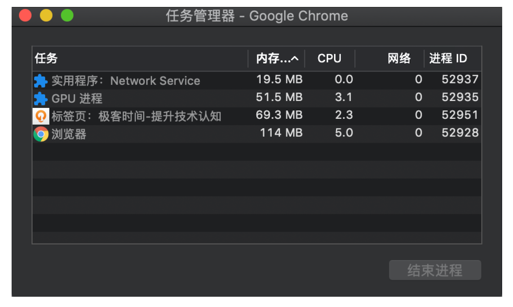
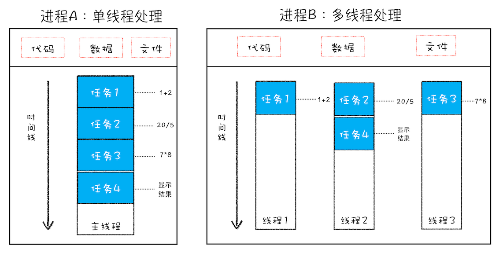
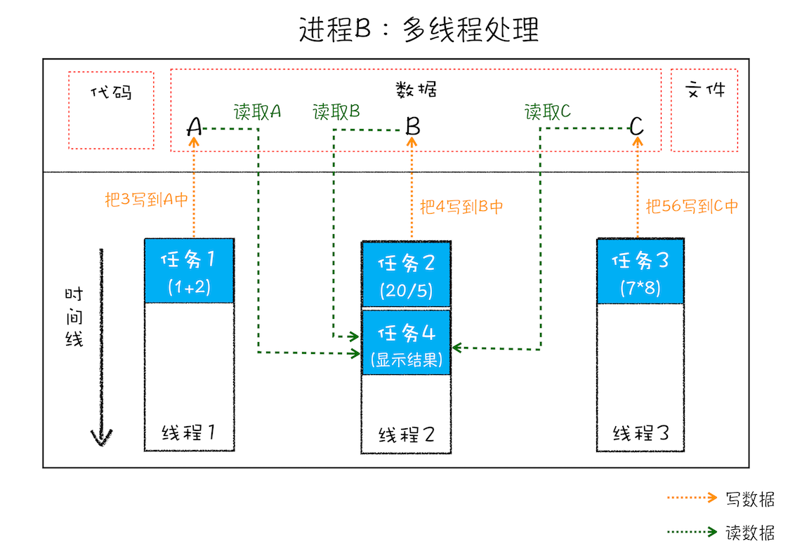

# Chrome架构：仅仅打开1个页面，为什么有4个进程

在开始之前，我们一起看下，Chrome打开一个页面需要启动多少进程？你可以点击Chrome浏览器右上角的“选项”菜单，选择“更多工具”子菜单，点击“任务管理器”，这将打开Chrome的任务管理器的窗口，如下图：



和Window任务管理器一样，Chrome任务管理器也是用来展示运行中Chrome使用的进程信息的。从图中可以看到，Chrome启动了4个进程，你也许会好奇，只是打开了1个页面，为什么要启动这么多进程呢？

在解答这个问题之前，我们需要了解一下进程的概念，不过由于好多人容易把进程和线程的概念混淆，从而影响后续其他概念的理解，所以这里我就将这两个概念以及他们之间的关系一并为你讲解下。

## 进程和线程

不过，在介绍进程和线程之前，我们需要先讲解下什么是并行处理，因为如果你理解了并行处理的概念，那么再理解进程和线程之间的关系就会变得轻松许多。

### 什么是并行处理

计算机中的并行处理就是同一时刻处理多个任务，比如我们要计算下面这三个表达式的值，并显示出结果。

```js
A = 1 + 2
B = 20 / 5
C = 7 * 8
```

在编写代码的时候，我们可以把这个过程拆分为四个任务：

- 任务1：计算A = 1 + 2。
- 任务2：计算B = 20 / 5。
- 任务3：计算C = 7 * 8。
- 任务4：显示最后计算的结果。

正常情况下程序可以使用单线程来处理，也就是分四步按照顺序分别执行者四个任务。

如果采用多线程，会怎么样呢？我们只需分“两步走”：

- 第一步：使用三个线程同时执行前三个任务。
- 第二步：再执行第四个显示任务。

通过对比分析，你会发现用单线程执行需要四步，而使用多线程只需要两步。因此，使用并行处理能大大提升性能。

### 线程 VS 进程

多线程可以并行处理任务，但是线程是不能单独存在的，它是由进程来启动和管理的。那什么又是进程呢？

一个进程就是一个程序的运行实例。详细解释就是，启动一个程序的时候，操作系统会为该程序创建一块内存，用来存放代码、运行中的数据和一个执行任务的主线程，我们把这样的一个运行环境叫进程。

为了让你更好地理解上述计算过程，我画了下面这张对比图。



从图中可以看到，线程是依附于进程的，而进程中使用多线程并行处理能提升运算效率。

总结来说，进程和线程之间的关系有以下4个特点。

#### 1.进程中的任意一线程执行出错，都会导致整个进程的崩溃。

我们可以模拟以下场景：

```js
A = 1 + 2
B = 20 / 0
C = 7 * 8
```

我把上述三个表达式稍作修改，在计算B的值的时候，我把表达式的分母改成0，当线程执行到 `B = 20 / 0` 时，由于分母为0，线程会执行出错，这样就会导致整个进程崩溃，当然另外两个线程执行的结果也没有了。

#### 2.线程之间共享进程中的数据。

如下图所示，线程之间可以对进程的公共数据进行读写操作。



从上图可以看出，线程1，线程2，线程3分别把执行的结果写入A、B、C中，然后线程2继续从A、B、C中读取数据，用来显示执行结果。

#### 3.当一个进程关闭之后，操作系统会回收进程所占用的内存。

当一个进程退出时，操作系统会回收该进程所申请的所有资源；即使其中任意线程因为操作不当导致内存泄漏，当进程退出时，这些内存也会被正确回收。

比如之前的IE浏览器，支持很多插件，而这些插件很容易导致内存泄漏，这意味着只要浏览器开着，内存占用就有可能会越来越多，但是当关闭浏览器进程时，这些内存就都会被系统回收掉。

#### 4.进程之间的内容相互隔离。

进程隔离是为了保护操作系统中进程互不干扰的技术，每一个进程只能访问自己占有的数据，也就避免出现进程A写入数据到进程B的情况。正是因为进程之间的数据是严格隔离的，所以一个进程如果崩溃了，或者挂起了，是不会影响到其他进程的。如果进程之间需要进行数据的通信，这时候就需要使用用于进程间通信（IPC）的机制了。
