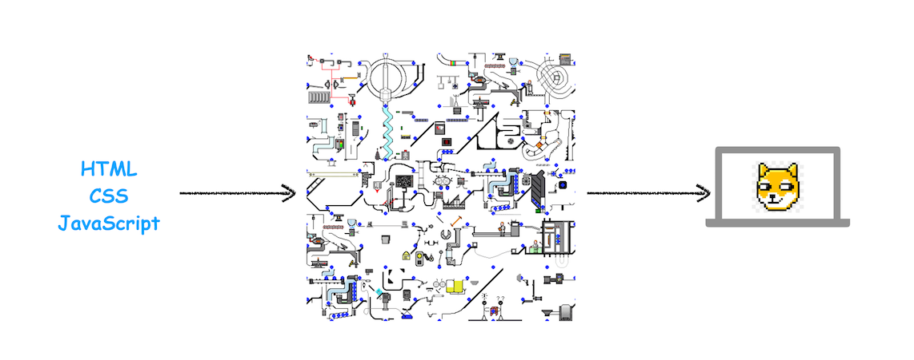
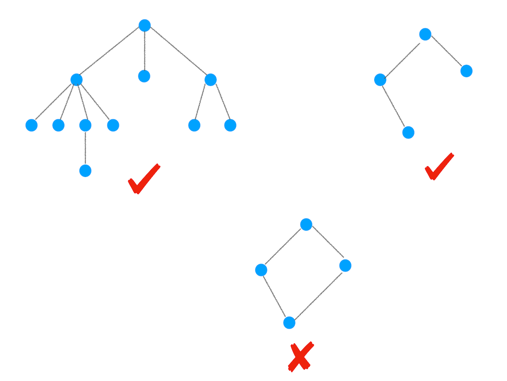
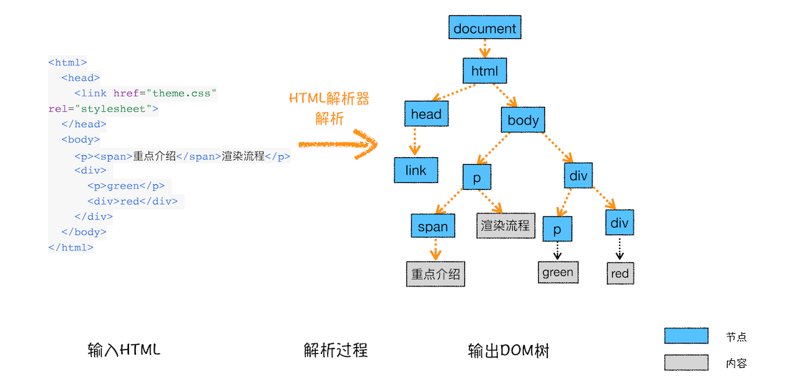
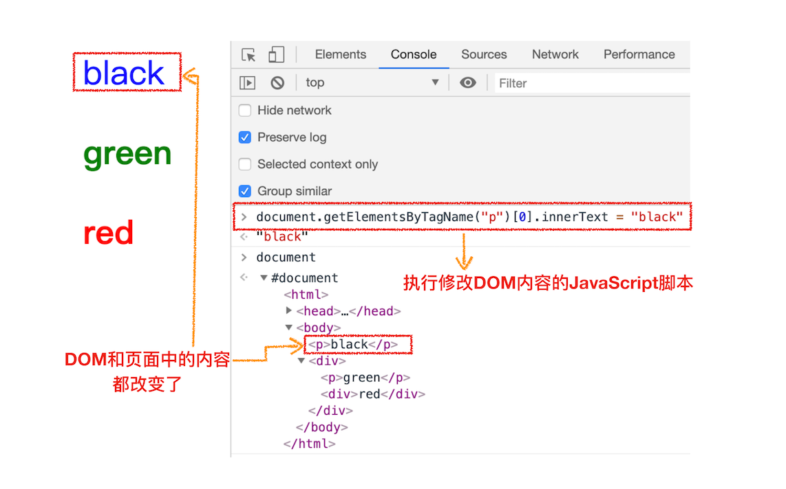

# 渲染流程（上）：HTML、CSS和JavaScript是如何变成页面的

在上一篇文章中我们介绍了导航相关的流程，那导航被提交后又会怎么样呢？就进入了渲染阶段。这个阶段很重要，了解其相关流程能让你“看透”页面是如何工作的，有了这些知识，你可以解决一系列相关的问题，比如能熟练使用开发者工具，因为能够理解开发者工具里面大部分项目的含义，能优化页面卡顿问题，使用 JavaScript 优化动画流程，通过优化样式表来防止强制同步布局，等等。

既然它的功能这么强大，那么今天，我们就来好好聊聊渲染流程。

通常，我们编写好 HTML、CSS、JavaScript 等文件，经过浏览器就会显示出漂亮的页面（如下图所示），但是你知道它们是如何转化成页面的吗？这背后的原理，估计很多人都答不上来。



从图中可以看出，左边输入的是 HTML、CSS、JavaScript 数据，这些数据经过中间渲染模块的处理，最终输出为屏幕上的像素。

这中间的渲染模块就是我们今天要讨论的主题。为了更好地理解下文，你可以先结合下图快速抓住 HTML、CSS 和 JavaScript 的含义：


从上图可以看出，HTML 的内容是由标记和文本组成。标记也称为标签，每个标签都有它自己的语意，浏览器会根据标签的语意来正确展示HTML内容。比如上面的 `<p>` 标签是告诉浏览器在这里的内容需要创建一个新段落，中间的文本就是段落中需要显示的内容。

如果需要改变 HTML 的字体颜色、大小等信息，就需要用到 CSS。CSS 又称为层叠样式表，是由选择器和属性组成，比如图中的p选择器，它会把HTML里面 `<p>` 标签的内容选择出来，然后再把选择器的属性值应用到 `<p>` 标签内容上。选择器里面有个 `color` 属性，它的值是 red，这是告诉渲染引擎把 `<p>` 标签的内容显示为红色。

至于 JavaScript（简称JS），使用它可以使网页的内容“动”起来，比如上图中，可以通过 JavaScript 来修改 CSS 样式值，从而达到修改文本颜色的目的。

搞清楚 HTML、CSS 和 JavaScript 的含义后，那么接下来我们就正式开始分析渲染模块了。

由于渲染机制过于复杂，所以渲染模块在执行过程中会被划分为很多子阶段，输入的 HTML 经过这些子阶段，最后输出像素。我们把这样的一个处理流程叫做渲染流水线，其大致流程如下图所示：


按照渲染的时间顺序，流水线可分为如下几个子阶段：构建 DOM 树、样式计算、布局阶段、分层、绘制、分块、光栅化和合成。内容比较多，我会用两篇文章来为你详细讲解各个子阶段。接下来，在介绍每个阶段的过程中，你应该重点关注以下三个内容。

- 开始每个子阶段都有其输入的内容。

- 然后每个子阶段有其处理过程。

- 最终每个子阶段会生成输出内容。

理解了这三部分内容，能让你更加清晰地理解每个子阶段。

## 构建DOM树

`为什么要构建 DOM 树呢`？这是因为浏览器无法直接理解和使用 HTML，所以需要将 HTML 装换为浏览器能够理解的结构——DOM 树。

这里我们还需要简单介绍下什么是树结构，为了更直观地理解，你可以参考下面我画的几个树结构：



从图中可以看出，树这种结构非常像我们现实生活中的“树”，其中每个点我们称为节点，相连的节点称为父子节点。树结构在浏览器中的应用还是比较多的，比如下面我们要介绍的渲染流程，就在频繁地使用树结构。

接下来咱们还是言归正传，来看看 DOM 树的构建过程，你可以参考下图。



从图中可以看出，构建 DOM 树的输入内容是一个非常简单的 HTML 文件，然后经由 HTML 解析器解析，最终输出树状结构的 DOM。

为了更加直观地理解 DOM 树，你可以打开 Chrome 的“开发者工具”，选择“Console”标签来打开控制台，然后在控制台里面输入“document”后回车，这样你就能看到一个完整的 DOM 树结构，如下图所示：


图中的 document 就是 DOM 结构，你可以看到，DOM 和 HTML 内容几乎是一样的，但是和 HTML 不同的是，DOM 是保存在内存中树状结构，可以通过 JavaScript 来查询或修改其内容。

那下面就来看看如何通过 JavaScript 来修改 DOM 的内容，在控制台中输入：

```js
document.getElementsByTagName('p')[0].innerText = 'black'
```

这行代码的作用是把第一个 `<p>` 标签的内容修改为 black，具体执行结果你可以参考下图：



从图中可以看出，在执行了一段修改第一个 `<p>` 标签的 JavaScript 代码后，DOM 的第一个 p 节点的内容成功被修改，同时页面中的内容也被修改了。

好了，现在我们已经生成 DOM 树了，但是 DOM 节点的样式我们依然不知道，要让 DOM 节点拥有正确的样式，这就需要样式计算了。
