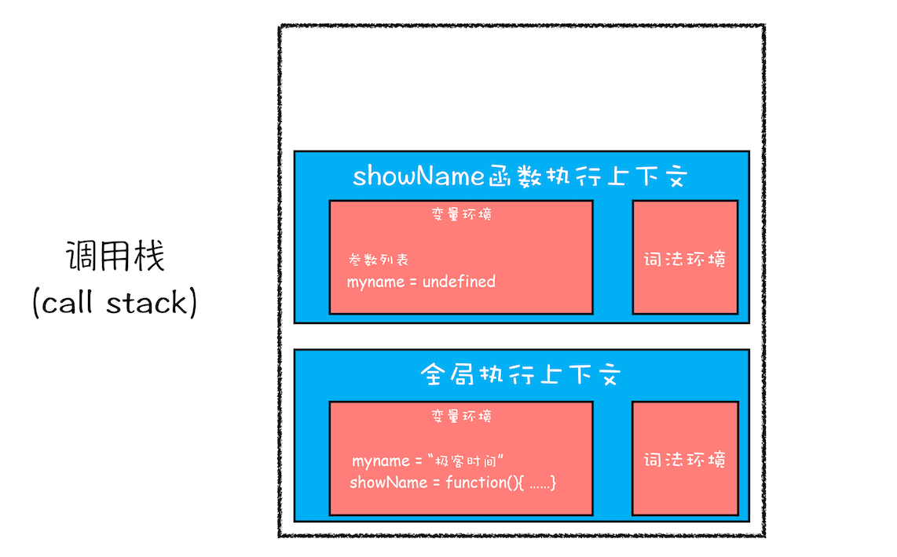

# 块级作用域：var缺陷以及为什么要引入let和const

在前面《07 | 变量提升：JavaScript代码是按顺序执行的吗？》这篇文章中，我们已经讲解了 JavaScript 中变量提升的相关内容，正是由于 JavaScript 存在变量提升这种特性，从而导致了很多与直觉不符的代码，这也是 JavaScript 的一个重要设计缺陷。

虽然 ECMAScript6（以下简称ES6）已经通过引入块级作用域并配合 let、const 关键字，来避开了这种设计缺陷，但是由于 JavaScript 需要保持向下兼容，所以变量提升在相当长一段时间内还会继续存在。这也加大了你理解概念的难度，因为既要理解新的机制，又要理解变量提升这套机制，关键这两套机制还是同时运行在“一套”系统中的。

但如果抛开 JavaScript 的底层去理解这些，那么你大概率会很难深入理解其概念。俗话说：“断病要断因，治病要治根”，所以为了便于你更好地理解和学习，今天我们这篇文章会先“探病因”——分析为什么在 JavaScript 中会存在变量提升，以及变量提升所带来的问题；然后再来“开药方”——介绍如何通过块级作用域并配合 let 和 const 关键字来修复这种缺陷。

## 作用域（scope）

为什么 JavaScript 中会存在变量提升这个特性，而其他语言似乎没有这个特性呢？要讲清楚这个问题，我们就得先从作用域讲起。

**作用域是指在程序中定义变量的区域，该位置决定了变量的生命周期。通俗地理解，作用域就是变量与函数的可访问范围，即作用域控制着变量和函数的可见性和生命周期。**

在 ES6 之前，ES 的作用域只有两种：全局作用域和函数作用域。

- 全局作用域中的对象在代码中的任何地方都能访问，其生命周期伴随着页面的生命周期。

- 函数作用域就是在函数内部定义的变量或者函数，并且定义的变量或者函数只能在函数内部被访问。函数执行结束之后，函数内部定义的变量会被销毁。

在 ES6 之前，JavaScript 只支持这两种作用域，相较而言，其他语言则都普遍支持块级作用域。块级作用域就是使用一对大括号包裹的一段代码，比如函数、判断语句、循环语句，甚至单独的一个 `{}` 都可以被看作是一个块级作用域。

为了更好地理解块级作用域，你可以参考下面的一些示例代码：

```js
// if块
if(1) {}

// while块
while(1) {}

// 函数块
function foo() {}
 
// for循环块
for(let i = 0; i < 100; i++) {}

// 单独一个块
{}
```

简单来讲，如果一种语言支持块级作用域，那么其代码块内部定义的变量在代码外部是访问不到的，并且等该代码块中的代码执行完成之后，代码块中定义的变量会被销毁。你可以看下面这段 C 代码：

```js
char* myname = '极客时间'
void showName() {
  printf('%s \n', myname)
  if(0) {
    char* myname = '极客邦'
  }
}

int main() {
  showName()
  return 0
}
```

上面这段 C 代码执行后，最终打印出来的是上面全局变量 myname 的值，之所以这样，是因为 C 语言是支持块级作用域的，所以 if 块里面定义的变量是不是被 if 块外面的语句访问到的。

和 Java、C/C++ 不同，ES6 之前是不支持块级作用域的，因为当初设计这门语言的时候，并没有想到 JavaScript 会火起来，所以只是按照最简单的方式来设计。没有了块级作用域，再把作用域内部的变量统一提升无疑是最快速、最简单的设计，不过这也直接导致了函数中的变量无论是在哪里声明的，在编译阶段都会被提取到执行上下文的变量环境中，所以这些变量在整个函数体内的任何地方都是能被访问的，这也就是 JavaScript 的变量提升。

## 变量提升所带来的问题

由于变量提升作用，使用 JavaScript 来编写和其他语言相同逻辑的代码，都有可能会导致不一样的执行结果。那为什么会出现这种情况呢？主要有以下两个原因。

### 1.变量容易在不被察觉的情况下被覆盖掉

比如我们重新使用 JavaScript 来实现上面那段 C 代码，实现后的 JavaScript 代码如下：

```js
var myname = '极客时间'
function showName() {
  console.log(myname)
  if(0) {
   var myname = '极客邦'
  }
  console.log(myname)
}
showName()
```

执行上面这段代码，打印出来的是 undefined，而并没有像前面 C 代码那样打印出来“极客时间”的字符串。为什么输出的内容是 undefined 呢？我们再来分析一下。

首先当刚执行到 showName 函数调用时，执行上下文和调用栈的状态是怎样的？具体分析过程你可以回顾《08 | 调用栈：为什么JavaScript代码会出现栈溢出？》这篇文章的分析过程，这里我就直接展示出来了，最终的调用栈状态如下图所示：



showName 函数的执行上下文创建后，JavaScript 引擎便开始执行 showName 函数内部的代码了。首先执行的是：

```js
console.log(myname)
```

执行这段代码需要使用变量 myname，结合上面的调用栈状态图，你可以看到这里有两个 myname 变量：一个在全局执行上下文中，其值是“极客时间”；另外一个在 showName 函数的执行上下文中，其值是 undefined。那么到底该使用哪个呢？

相信做过 JavaScript 开发的同学都能轻松回答出来答案：“当然是先使用函数执行上下文里面的变量啦！”的确是这样的，这是因为在函数执行过程中，JavaScript 会优先从当前的执行上下文中查找变量，由于变量提升，当前的执行上下文就包含了变量 myname，而值是 undefined，所以获取到的 myname 的值就是 undefined。

这输出的结果和其他大部分支持块级作用域的语言都不一样，比如上面 C 语言输出的就是全局变量，所以这会很容易造成误解，特别是在你会一些其他语言的基础之上，再来学习 JavaScript，你会觉得这种结果很不自然。

### 2.本应销毁的变量没有被销毁

接下来我们再来看下面这段让人误解更大的代码：

```js
function foo() {
  for(var i = 0; i < 7; i++) {}
  console.log(i);
}
foo()
```

如果你使用 C 语言或者其他的大部分语言实现类似代码，在 for 循环结束之后，i 就已经被销毁了，但是在 JavaScript 代码中，i 的值并未被销毁，所以最后打印出来的是 7。

这同样也是由变量提升而导致的，在创建执行上下文阶段，变量 i 就已经被提升了，所以当 for 循环结束之后，变量 i 并没有被销毁。

这依旧和其他支持块级作用域的语言表现是不一致的，所以必然会给一些人造成误解。
