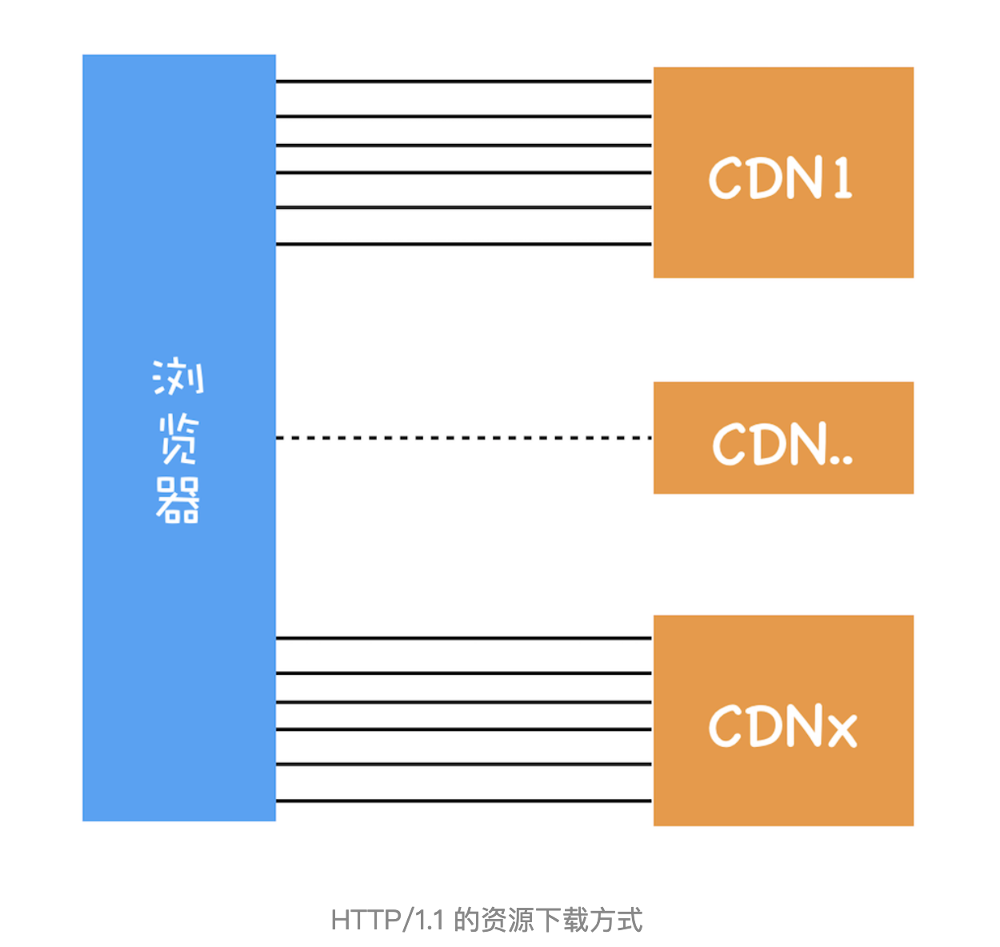

# HTTP2：如何提升网络速度

上一篇文章我们聊了 HTTP / 1.1 的发展史，虽然 HTTP / 1.1 已经做了大量的优化，但是依然存在很多性能瓶颈，依然不能满足我们日益变化的新需求，所以就有了我们今天要聊的 HTTP / 2。

本文我们依然从需求的层面来谈，先分析 HTTP / 1.1 存在哪些问题，然后再来分析 HTTP / 2 是如何解决这些问题的。

我们知道 HTTP / 1.1 为网络效率做了大量的优化，最核心的有如下三种方式：

- 增加持久连接。

- 浏览器为每个域名最多同时维护 6 个 TCP 持久连接。

- 使用 CDN 实现域名分片机制。

通过这些方式就大大提高了页面的下载速度，你可以通过下图来直观感受下：

在该图中，引入了 CDN，并同时为每个域名维护 6 个连接，这样就大大减轻了整个资源的下载时间。这里我们可以简单计算下：如果使用单个 TCP 的持久连接，下载 100 个资源所花费的时间为 100 * n * RTT；若通过上面的技术，就可以把整个时间缩短为 100 * n * RTT / (6 * CDN 个数)。从这个计算结果来看，我们的页面加载速度变快了不少。
