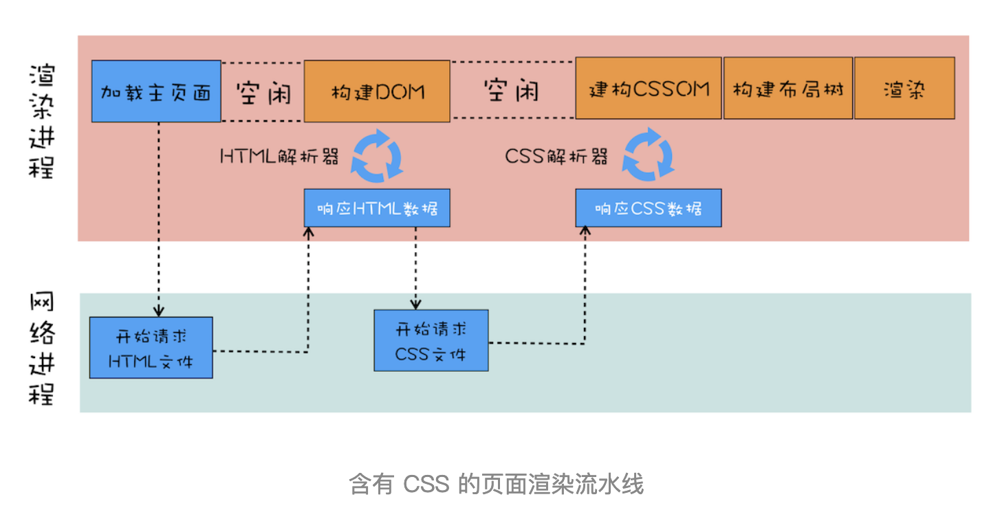

# 渲染流水线：CSS如何影响首次加载时的白屏时间

在上一篇文章中我们详细介绍了 DOM 的生成过程，并结合具体例子分析了 JavaScript 是如何阻塞 DOM 生成的。那本文我们就继续深入聊聊渲染流水线中的 CSS。因为 CSS 是页面中非常重要的资源，它决定了页面最终显示出来的效果，并影响着用户对整个网站的第一体验。所以，搞清楚浏览器中的 CSS 是怎么工作的很有必要，只有理解了 CSS 是如何工作的，你才能更加深刻地理解如何去优化页面。

本文我们先站在渲染流水线的视角来介绍 CSS 是如何工作的，然后通过 CSS 的工作流程来分析性能瓶颈，最后再来讨论如何减少首次加载时的白屏时间。

渲染流水线视角下的 CSS 我们先结合下面代码来看看最简单的渲染流程：

```css
/* theme.css */
div{ 
  color: coral;
  background-color: black;
}
```

```html
<html>
  <head>
    <link href="theme.css" rel="stylesheet">
  </head>
  <body>
    <div>geekbang com</div>
  </body>
</html>
```

这两段代码分别由 CSS 文件和 HTML 文件构成，我们来分析下打开这段 HTML 文件时的渲染流水线，你可以先参考下面这张渲染流水线示意图：



下面我们结合上图来分析这个页面文件的渲染流水线。

首先是发起主页面的请求，这个发起请求方可能是渲染进程，也有可能是浏览器进程，发起的请求被送到网络进程中去执行。网络进程接收到返回的 HTML 数据之后，将其发送给渲染进程，渲染进程会解析 HTML 数据并构建 DOM。这里你需要特别注意下，请求 HTML 数据和构建 DOM 中间有一段空闲时间，这个空闲时间有可能成为页面渲染的瓶颈。

上一篇文章中我们提到过，当渲染进程接收 HTML 文件字节流时，会先开启一个预解析线程，如果遇到 JavaScript 文件或者 CSS 文件，那么预解析线程会提前下载这些数据。对于上面的代码，预解析线程会解析出来一个外部的 theme.css 文件，并发起 theme.css 的下载。这里也有一个空闲时间需要你注意一下，就是在 DOM 构建结束之后、theme.css 文件还未下载完成的这段时间内，渲染流水线无事可做，因为下一步是合成布局树，而合成布局树需要 CSSOM 和 DOM，所以这里需要等待 CSS 加载结束并解析成 CSSOM。
