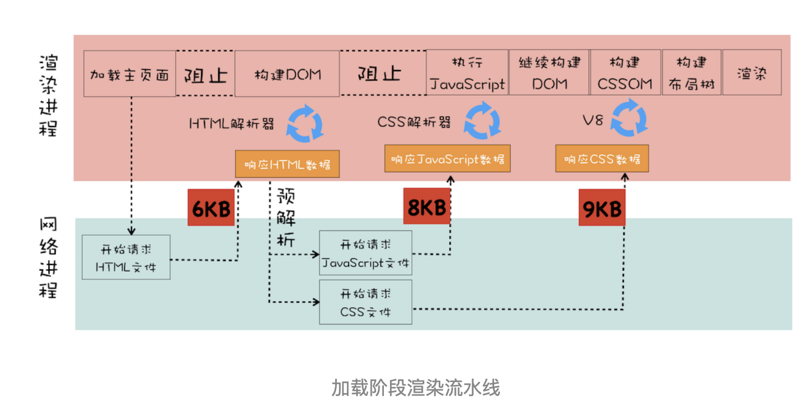

# 页面性能：如何系统优化页面

在前面几篇文章中，我们分析了页面加载和 DOM 生成，讨论了 JavaScript 和 CSS 是如何影响到 DOM 生成的，还结合渲染流水线来讲解了分层和合成机制，同时在这些文章里面，我们还穿插说明了很多优化页面性能的最佳实践策略。通过这些知识点的学习，相信你已经知道渲染引擎是怎么绘制出帧的，不过之前我们介绍的内容比较零碎、比较散，那么今天我们就来将这些内容系统性地串起来。

那么怎么才能把这些知识点串起来呢？我的思路是从如何系统优化页面速度的角度来切入。

这里我们所谈论的页面优化，其实就是要让页面更快地显示和响应。由于一个页面在它不同的阶段，所侧重的关注点是不一样的，所以如果我们要讨论页面优化，就要分析一个页面生存周期的不同阶段。

**通常一个页面有三个阶段：加载阶段、交互阶段和关闭阶段**

- 加载阶段，是指从发出请求到渲染出完整页面的过程，影响到这个阶段的主要因素有网络和 JavaScript 脚本。

- 交互阶段，主要是从页面加载完成到用户交互的整个过程，影响到这个阶段的主要因素是 JavaScript 脚本。

- 关闭阶段，主要是用户发出关闭指令后页面所做的一些清理操作。

这里我们需要重点关注加载阶段和交互阶段，因为影响到我们体验的因素主要都在这两个阶段，下面我们就来逐个详细分析下。

## 加载阶段

我们先来分析如何系统优化加载阶段中的页面，还是先看一个典型的渲染流水线，如下图所示：

观察上面这个渲染流水线，你能分析出来有哪些因素影响了页面加载速度吗？下面我们就来分析下这个问题。

通过前面文章的讲解，你应该已经知道了并非所有的资源都会阻塞页面的首次绘制，比如图片、音频、视频等文件就不会阻塞页面的首次渲染；而 JavaScript、首次请求的 HTML 资源文件、CSS 文件是会阻塞首次渲染的，因为在构建 DOM 的过程中需要 HTML 和 JavaScript 文件，在构造渲染树的过程中需要用到 CSS 文件。

我们把这些能阻塞网页首次渲染的资源称为关键资源。基于关键资源，我们可以继续细化出来三个影响页面首次渲染的核心因素。

**第一个是关键资源个数。关键资源个数越多，首次页面的加载时间就会越长**。比如上图中的关键资源个数就是 3 个，1 个 HTML 文件、1 个 JavaScript 和 1 个 CSS 文件。

**第二个是关键资源大小**。通常情况下，所有关键资源的内容越小，其整个资源的下载时间也就越短，那么阻塞渲染的时间也就越短。上图中关键资源的大小分别是 6KB、8KB 和 9KB，那么整个关键资源大小就是 23KB。

**第三个是请求关键资源需要多少个 RTT（Round Trip Time）**。那什么是 RTT 呢？在《02 | TCP 协议：如何保证页面文件能被完整送达浏览器？》这篇文章中我们分析过，当使用 TCP 协议传输一个文件时，比如这个文件大小是 0.1M，由于 TCP 的特性，这个数据并不是一次传输到服务端的，而是需要拆分成一个个数据包来回多次进行传输的。RTT 就是这里的往返时延。它是网络中一个重要的性能指标，表示从发送端发送数据开始，到发送端收到来自接收端的确认，总共经历的时延。通常 1 个 HTTP 的数据包在 14KB 左右，所以 1 个 0.1M 的页面就需要拆分为 8 个包来传输了，也就是说需要 8 个 RTT。

我们可以结合上图来看看它的关键资源请求需要多少个 RTT。首先是请求 HTML 资源，大小是 6KB，小于 14KB，所以 1 个 RTT 就可以解决了。至于 JavaScript 和 CSS 文件，这里需要注意一点，由于渲染引擎有一个预解析的线程，在接收到 HTML 数据之后，预解析线程会快速扫描 HTML 数据中的关键资源，一旦扫描到了，会立马发起请求，你可以认为 JavaScript 和 CSS 是同时发起请求的，所以它们的请求是重叠的，那么计算它们的 RTT 时，只需要计算体积最大的那个数据就可以了。这里最大的是 CSS 文件（9KB），所以我们就按照 9KB 来计算，同样由于 9KB 小于 14KB，所以 JavaScript 和 CSS 资源也就可以算成 1 个 RTT。也就是说，上图中关键资源请求共花费了 2 个 RTT。

了解了影响加载过程中的几个核心因素之后，接下来我们就可以系统性地考虑优化方案了。**总的优化原则就是减少关键资源个数，降低关键资源大小，降低关键资源的 RTT 次数**

- 如何减少关键资源的个数？一种方式是可以将 JavaScript 和 CSS 改成内联的形式，比如上图的 JavaScript 和 CSS，若都改成内联模式，那么关键资源的个数就由 3 个减少到了 1 个。另一种方式，如果 JavaScript 代码没有 DOM 或者 CSSOM 的操作，则可以改成 async 或者 defer 属性；同样对于 CSS，如果不是在构建页面之前加载的，则可以添加媒体取消阻止显现的标志。当 JavaScript 标签加上了 async 或者 defer、CSSlink 属性之前加上了取消阻止显现的标志后，它们就变成了非关键资源了。

- 如何减少关键资源的大小？可以压缩 CSS 和 JavaScript 资源，移除 HTML、CSS、JavaScript 文件中一些注释内容，也可以通过前面讲的取消 CSS 或者 JavaScript 中关键资源的方式。

- 如何减少关键资源 RTT 的次数？可以通过减少关键资源的个数和减少关键资源的大小搭配来实现。除此之外，还可以使用 CDN 来减少每次 RTT 时长。

在优化实际的页面加载速度时，你可以先画出优化之前关键资源的图表，然后按照上面优化关键资源的原则去优化，优化完成之后再画出优化之后的关键资源图表。
